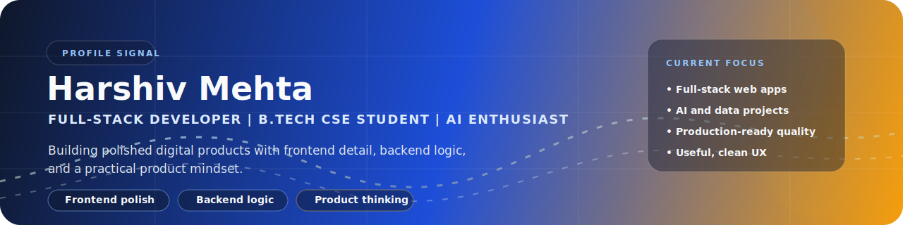

  <a href="https://portfolio-website-drab-rho.vercel.app">Portfolio</a> |
  <a href="https://github.com/Harshiv-Mehta">GitHub</a> |
  <a href="https://linkedin.com/in/harshiv-mehta">LinkedIn</a> |
  <a href="mailto:Harshivmehta@gmail.com">Email</a>

## About

I am a B.Tech Computer Science and Engineering student at DESPU University focused on full-stack development, backend fundamentals, and high-quality frontend execution. I build projects end to end, from UI and user flow to APIs, persistence, and deployment.

My goal is to become the kind of engineer who can ship clean, usable products with strong technical foundations.

## What I Am Focused On

- Building production-ready full-stack projects
- Improving backend architecture and API design
- Creating interfaces that feel intentional and easy to use
- Exploring AI, analytics, and data-driven product ideas

## Selected Work

### WhisperSpace
Anonymous social sharing platform built with Node.js, Express, MongoDB, and JavaScript.

- Built anonymous posting and reply flows with a simple, low-friction user experience
- Structured the project for deployment and full-stack feature delivery
- [Live Demo](https://whisper-space-chi.vercel.app)
- [Repository](https://github.com/Harshiv-Mehta/WhisperSpace-)

### FinGuard
Financial safety net project built with FastAPI, SQLite, SQLAlchemy, and an interactive dashboard.

- Implemented transaction analysis, risk scoring, and alert-oriented product features
- Strengthened API design, backend organization, and data-driven decision flows
- [Repository](https://github.com/Harshiv-Mehta/finguard)

### SparkScale Marketing
Marketing website built for a digital growth and branding agency.

- Built a polished multi-section frontend with strong hierarchy and brand presentation
- Focused on responsiveness, conversion-oriented structure, and visual clarity
- [Live Demo](https://sparkscale-marketing.vercel.app)
- [Repository](https://github.com/Harshiv-Mehta/sparkscale-marketing)

### Inhale Art Store
Boutique-style storefront for handmade resin jewelry and keepsakes.

- Built customer-facing storefront flows, authentication-related screens, and admin-side pages
- Focused on product presentation, shopping UX, and practical interface design
- [Repository](https://github.com/Harshiv-Mehta/inhaleart-store)

### Portfolio Website
Personal portfolio website that presents my work, background, and project direction.

- Built to present my work with stronger communication, structure, and visual quality
- [Live Website](https://portfolio-website-drab-rho.vercel.app)
- [Repository](https://github.com/Harshiv-Mehta/portfolio-website)

## Skills

**Languages:** `C`, `C++`, `Java`, `Python`, `JavaScript`  
**Web:** `HTML`, `CSS`, `Node.js`, `Express.js`, `FastAPI`  
**Databases:** `MongoDB`, `SQL`, `SQLite`, `Firebase`  
**Tools:** `Git`, `GitHub`, `Postman`, `VS Code`, `Vercel`, `Power BI`

## Education

**DESPU University**  
B.Tech in Computer Science and Engineering, 2024-2028  
CGPA: 8.24

## Experience

**Creative Designer, YouTube Channels**  
2023-2024

- Designed thumbnails and banners for content creators
- Improved visual identity and presentation consistency across multiple channels
- Built early hands-on experience in design quality and audience-facing communication

## Certifications

- [Software Engineering - Infosys](./certifications/software-engineering-infosys.pdf)
- [Agile Methodology - Infosys](./certifications/agile-methodology-infosys.pdf)
- [Introduction to Data Science - Infosys](./certifications/introduction-to-data-science-infosys.pdf)
- [Introduction to Natural Language Processing - Infosys](./certifications/introduction-to-nlp-infosys.pdf)
- [Introduction to AI Concepts - Microsoft](./certifications/intro-to-ai-concepts-microsoft.pdf)
- [Intro to Generative AI and Agents - Microsoft](./certifications/intro-to-generative-ai-and-agents-microsoft.pdf)
- [Data Analysis - Microsoft](./certifications/data-analysis-microsoft.pdf)
- [Power BI - Microsoft](./certifications/power-bi-microsoft.pdf)

## Highlights

- Selected at the college level for Smart India Hackathon 2024
- Built and deployed multiple live web projects on Vercel
- Comfortable working across both interface quality and backend logic
- Interested in internships and opportunities where I can contribute, learn quickly, and build production-grade software

## GitHub Activity

  

  

  

